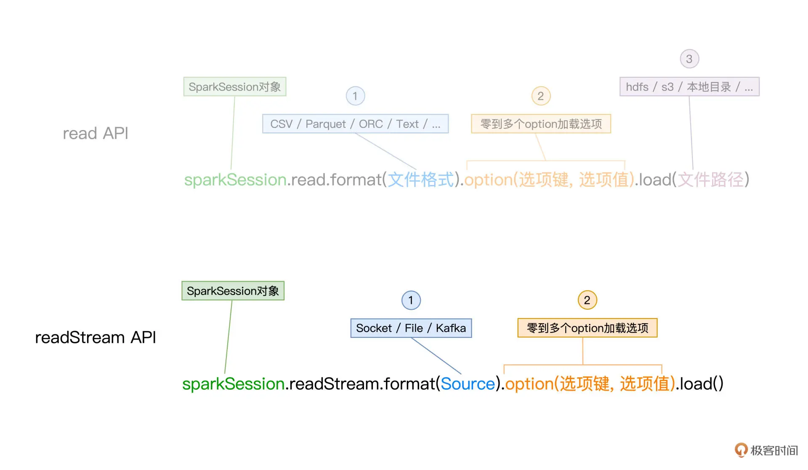
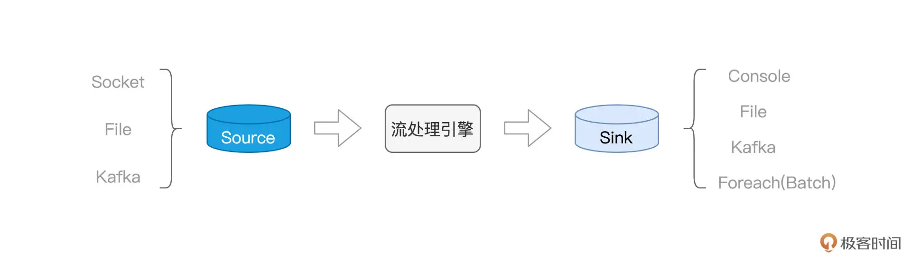
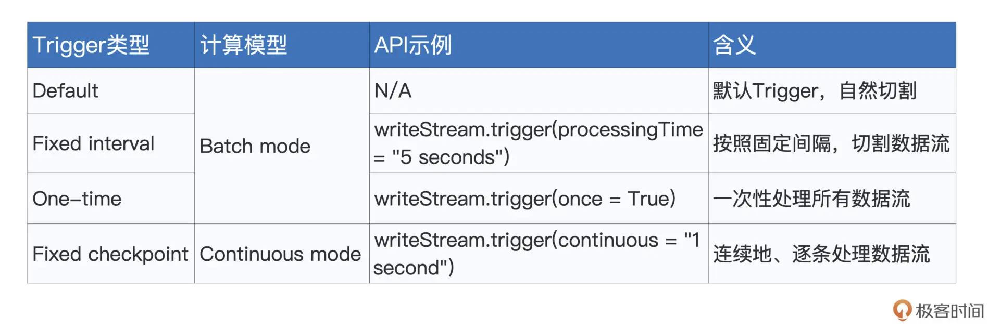

还是以word count 为例子介绍sparkstreaming。
SparksStreaming 监听Socket输入单词，并实时计算 wordcount。因此需要两步
1. 我们使用 netcat 工具，向本地 9999 端口的 Socket 地址发送数据行。 nc -lk 9999 
2. 编写 sparkstreaming code，监听9999端口并实现wordcount

Scala Code 如下：

```py
import org.apache.spark.sql.DataFrame
 
# 设置需要监听的本机地址与端口号
val host: String = "127.0.0.1"
val port: String = "9999"

# 从监听地址创建DataFrame
var df: DataFrame = spark.readStream
.format("socket")
.option("host", host)
.option("port", port)
.load()

# 使用DataFrame API完成Word Count计算

# 首先把接收到的字符串，以空格为分隔符做拆分，得到单词数组words
df = df.withColumn("words", split($"value", " "))
 
# 把数组words展平为单词word
.withColumn("word", explode($"words"))
 
# 以单词word为Key做分组
.groupBy("word")
 
# 分组计数
.count()

# 将Word Count结果写入到终端（Console）
df.writeStream
# 指定Sink为终端（Console）
.format("console")
 
# 指定输出选项
.option("truncate", false)
 
# 指定输出模式
.outputMode("complete")
# .outputMode("update")
 
# 启动流处理应用
.start()
# 等待中断指令
.awaitTermination()
```

## 数据load：Spark readStream API
spark readStrem API 和之前的spakr session read API 几乎一样，也是有三类基本要素构成 
  - format：指定流处理的数据源头类型. Socket、路径下的File 和 Kafka
  - option：与数据源头有关的若干选项. 指定数据源的具体地址、访问权限等
  - load：将数据流加载进 Spark.



## 数据处理：wordcode 代码


## 数据输出：writeStream API 
writeStream API 和 Spark session 的 Write API 也极其的相似。
  - format： 数据输出的格式。 Console、File、Kafka 和 Foreach(Batch)
  - option：option 则是与format类型相关的输出选项，比如与 Console 相对应的“truncate”选项
  - outputMode：指定数据流的输出模式。
        - Complete mode：输出到目前为止处理过的全部内容
        - Append mode：仅输出最近一次作业的计算结果
        - Update mode：仅输出内容有更新的计算结果

数据流程总结下来如下图:


# Spark 流处理引擎 Structured Streaming

Structured Streaming 天然能够享受 Spark SQL 提供的处理能力与执行性能，同时也能与其他子框架无缝衔接。当数据像水流一样，源源不断地流进 Structured Streaming 引擎的时候，引擎并不会自动地依次消费并处理这些数据，它需要一种叫做 Trigger 的机制，来触发数据在引擎中的计算。Structured Streaming 支持 4 种 Trigger 。要为流处理设置 Trigger，我们只需基于 writeStream API，调用 trigger 函数即可。我们需要重点掌握计算模型



如图所示计算模型分为两种。Batch mode 和 Continuous mode

## batch mode 

Batch mode 指的是 Spark 将连续的数据流，切割为离散的数据微批（Micro-batch），也即小份的数据集。而每一份 Micro-batch，都会触发一个 Spark Job，每一个 Job 会包含若干个 Tasks。


在batch mode 下，不同种类的 Trigger，如 Default、Fixed interval 以及 One-time，无非是在以不同的方式控制 Micro-batch 切割的粒度罢了。
  
## continuous mode 

与 Batch mode 不同，Continuous mode 并不切割数据流，而是以事件 / 消息（Event / Message）为粒度，用连续的方式来处理数据。这里的事件或是消息，指代的是原始数据流中最细粒度的数据形式，它可以是一个单词、一行文本，或是一个画面帧。

