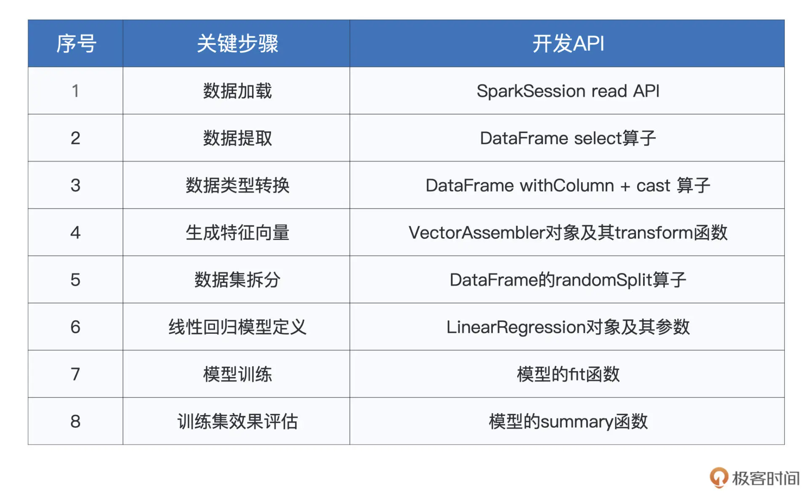

为兼顾项目的权威性与代表性，这里我选择了 Kaggle（数据科学竞赛平台）的“House Prices - Advanced Regression Techniques”竞赛项目。这个项目的要求是，给定房屋的 79 个属性特征以及历史房价，训练房价预测模型，并在测试集上验证模型的预测效果。
数据下载： 

解压之后，我们会得到 4 个文件，分别是 data_description.txt、train.csv、test.csv 和 sample_submission.csv。


## 机器学习简介
所谓机器学习（Machine Learning），它指的是这样一种计算过程：对于给定的训练数据（Training samples），选择一种先验的数据分布模型（Models），然后借助优化算法（Learning Algorithms）自动地持续调整模型参数（Model Weights / Parameters），从而让模型不断逼近训练数据的原始分布。 持续调整模型参数的过程称为“模型训练”（Model Training）。

### 模型选型
在机器学习领域，模型的种类非常多。 
1. 按照拟合能力来分类，有线性模型与非线性模型之分；
2. 按照预测标的来划分，有回归、分类、聚类、挖掘之分；
3. 按照模型复杂度来区分，模型可以分为经典算法与深度学习；
4. 按照模型结构来说，又可以分为广义线性模型、树模型、神经网络，等等。

在房价预测这个项目中，我们预测的是房价，房价是连续的数值，因此我们使用回归模型（Regression Model）。 这个模型最简单。 

### 数据探索
我们拿到数据之后，需要知道哪些属性对房价的影响较大，哪些属性对房间的影响较小，这些属性称之为 数据特征，选择有效的数据特征的过程，叫做特征选择。 

```

import org.apache.spark.sql.DataFrame
 
val rootPath: String = _
val filePath: String = s"${rootPath}/train.csv"
 
// 从CSV文件创建DataFrame
val trainDF: DataFrame = spark.read.format("csv").option("header", true).load(filePath)
 
trainDF.show
trainDF.printSchema

```


### 数据提取
咱们不妨一切从简，只选取那些数值型特征（这类特征简单直接，适合上手），如建筑面积、地上面积、地下室面积和车库面积，即"LotArea"，“GrLivArea”，“TotalBsmtSF"和"GarageArea”.

```
import org.apache.spark.sql.DataFrame
import org.apache.spark.sql.types.IntegerType
 
val rootPath: String = _
val filePath: String = s"${rootPath}/train.csv"
 
# 从CSV文件创建DataFrame
val trainDF: DataFrame = spark.read.format("csv").option("header", true).load(filePath)

# 提取用于训练的特征字段与预测标的（房价SalePrice）
val selectedFields: DataFrame = trainDF.select("LotArea", "GrLivArea", "TotalBsmtSF", "GarageArea", "SalePrice")

# 将所有字段都转换为整型Int
val typedFields = selectedFields
.withColumn("LotAreaInt",col("LotArea").cast(IntegerType)).drop("LotArea")
.withColumn("GrLivAreaInt",col("GrLivArea").cast(IntegerType)).drop("GrLivArea")
.withColumn("TotalBsmtSFInt",col("TotalBsmtSF").cast(IntegerType)).drop("TotalBsmtSF")
.withColumn("GarageAreaInt",col("GarageArea").cast(IntegerType)).drop("GarageArea")
.withColumn("SalePriceInt",col("SalePrice").cast(IntegerType)).drop("SalePrice")
 
typedFields.printSchema

```

### 准备训练样本
当数据准备好了之后，我们就可以看是准备训练样本。 
第一步，我们把准备用于训练的多个特征字段，捏合成一个特征向量（Feature Vectors），如下所示。
```
import org.apache.spark.sql.DataFrame
import org.apache.spark.sql.types.IntegerType
import org.apache.spark.ml.feature.VectorAssembler
 
val rootPath: String = _
val filePath: String = s"${rootPath}/train.csv"
 
# 从CSV文件创建DataFrame
val trainDF: DataFrame = spark.read.format("csv").option("header", true).load(filePath)

# 提取用于训练的特征字段与预测标的（房价SalePrice）
val selectedFields: DataFrame = trainDF.select("LotArea", "GrLivArea", "TotalBsmtSF", "GarageArea", "SalePrice")

# 将所有字段都转换为整型Int
val typedFields = selectedFields
.withColumn("LotAreaInt",col("LotArea").cast(IntegerType)).drop("LotArea")
.withColumn("GrLivAreaInt",col("GrLivArea").cast(IntegerType)).drop("GrLivArea")
.withColumn("TotalBsmtSFInt",col("TotalBsmtSF").cast(IntegerType)).drop("TotalBsmtSF")
.withColumn("GarageAreaInt",col("GarageArea").cast(IntegerType)).drop("GarageArea")
.withColumn("SalePriceInt",col("SalePrice").cast(IntegerType)).drop("SalePrice")
 
# 待捏合的特征字段集合
val features: Array[String] = Array("LotAreaInt", "GrLivAreaInt", "TotalBsmtSFInt", "GarageAreaInt")
 
# 准备“捏合器”，指定输入特征字段集合，与捏合后的特征向量字段名
val assembler = new VectorAssembler().setInputCols(features).setOutputCol("features")
 
#  调用捏合器的transform函数，完成特征向量的捏合
val featuresAdded: DataFrame = assembler.transform(typedFields)
.drop("LotAreaInt")
.drop("GrLivAreaInt")
.drop("TotalBsmtSFInt")
.drop("GarageAreaInt")

# 我们把训练样本成比例地分成两份，一份用于模型训练，剩下的部分用于初步验证模型效果。

val Array(trainSet, testSet) = featuresAdded.randomSplit(Array(0.7, 0.3))

```

### 模型训练
使用 Spark MLlib 构建并训练模型，非常简单直接，只需 3 个步骤即可搞定。
第一步是导入相关的模型库，在 Spark MLlib 中，线性回归模型由 LinearRegression 类实现。
第二步是创建模型实例，并指定模型训练所需的必要信息。
第三步是调用模型的 fit 函数，同时提供训练数据集，开始训练。

```
import org.apache.spark.sql.DataFrame
import org.apache.spark.sql.types.IntegerType
import org.apache.spark.ml.feature.VectorAssembler

import org.apache.spark.ml.regression.LinearRegression
 
val rootPath: String = _
val filePath: String = s"${rootPath}/train.csv"
 
# 从CSV文件创建DataFrame
val trainDF: DataFrame = spark.read.format("csv").option("header", true).load(filePath)

# 提取用于训练的特征字段与预测标的（房价SalePrice）
val selectedFields: DataFrame = trainDF.select("LotArea", "GrLivArea", "TotalBsmtSF", "GarageArea", "SalePrice")

# 将所有字段都转换为整型Int
val typedFields = selectedFields
.withColumn("LotAreaInt",col("LotArea").cast(IntegerType)).drop("LotArea")
.withColumn("GrLivAreaInt",col("GrLivArea").cast(IntegerType)).drop("GrLivArea")
.withColumn("TotalBsmtSFInt",col("TotalBsmtSF").cast(IntegerType)).drop("TotalBsmtSF")
.withColumn("GarageAreaInt",col("GarageArea").cast(IntegerType)).drop("GarageArea")
.withColumn("SalePriceInt",col("SalePrice").cast(IntegerType)).drop("SalePrice")
 
# 待捏合的特征字段集合
val features: Array[String] = Array("LotAreaInt", "GrLivAreaInt", "TotalBsmtSFInt", "GarageAreaInt")
 
# 准备“捏合器”，指定输入特征字段集合，与捏合后的特征向量字段名
val assembler = new VectorAssembler().setInputCols(features).setOutputCol("features")
 
#  调用捏合器的transform函数，完成特征向量的捏合
val featuresAdded: DataFrame = assembler.transform(typedFields)
.drop("LotAreaInt")
.drop("GrLivAreaInt")
.drop("TotalBsmtSFInt")
.drop("GarageAreaInt")

# 我们把训练样本成比例地分成两份，一份用于模型训练，剩下的部分用于初步验证模型效果。

val Array(trainSet, testSet) = featuresAdded.randomSplit(Array(0.7, 0.3))

# 构建线性回归模型，指定特征向量、预测标的与迭代次数
val lr = new LinearRegression()
.setLabelCol("SalePriceInt")
.setFeaturesCol("features")
.setMaxIter(10)
 
# 使用训练集trainSet训练线性回归模型
val lrModel = lr.fit(trainSet)

```

### 模型效果评估
模型训练好之后，我们需要对模型的效果进行验证、评估，才能判定模型的“好”、“坏”。 在线性回归模型的评估中，我们有很多的指标，用来量化模型的预测误差。其中最具代表性的要数 RMSE（Root Mean Squared Error），也就是均方根误差。

```
import org.apache.spark.sql.DataFrame
import org.apache.spark.sql.types.IntegerType
import org.apache.spark.ml.feature.VectorAssembler

import org.apache.spark.ml.regression.LinearRegression
 
val rootPath: String = _
val filePath: String = s"${rootPath}/train.csv"
 
# 从CSV文件创建DataFrame
val trainDF: DataFrame = spark.read.format("csv").option("header", true).load(filePath)

# 提取用于训练的特征字段与预测标的（房价SalePrice）
val selectedFields: DataFrame = trainDF.select("LotArea", "GrLivArea", "TotalBsmtSF", "GarageArea", "SalePrice")

# 将所有字段都转换为整型Int
val typedFields = selectedFields
.withColumn("LotAreaInt",col("LotArea").cast(IntegerType)).drop("LotArea")
.withColumn("GrLivAreaInt",col("GrLivArea").cast(IntegerType)).drop("GrLivArea")
.withColumn("TotalBsmtSFInt",col("TotalBsmtSF").cast(IntegerType)).drop("TotalBsmtSF")
.withColumn("GarageAreaInt",col("GarageArea").cast(IntegerType)).drop("GarageArea")
.withColumn("SalePriceInt",col("SalePrice").cast(IntegerType)).drop("SalePrice")
 
# 待捏合的特征字段集合
val features: Array[String] = Array("LotAreaInt", "GrLivAreaInt", "TotalBsmtSFInt", "GarageAreaInt")
 
# 准备“捏合器”，指定输入特征字段集合，与捏合后的特征向量字段名
val assembler = new VectorAssembler().setInputCols(features).setOutputCol("features")
 
#  调用捏合器的transform函数，完成特征向量的捏合
val featuresAdded: DataFrame = assembler.transform(typedFields)
.drop("LotAreaInt")
.drop("GrLivAreaInt")
.drop("TotalBsmtSFInt")
.drop("GarageAreaInt")

# 我们把训练样本成比例地分成两份，一份用于模型训练，剩下的部分用于初步验证模型效果。

val Array(trainSet, testSet) = featuresAdded.randomSplit(Array(0.7, 0.3))

# 构建线性回归模型，指定特征向量、预测标的与迭代次数
val lr = new LinearRegression()
.setLabelCol("SalePriceInt")
.setFeaturesCol("features")
.setMaxIter(10)
 
# 使用训练集trainSet训练线性回归模型
val lrModel = lr.fit(trainSet)

val trainingSummary = lrModel.summary
println(s"RMSE: ${trainingSummary.rootMeanSquaredError}")

```

