# spark notes
本文以word count 为例，介绍spark的基础知识。


## word count 

Word Count 的初衷是对文件中的单词做统计计数，打印出频次最高的 5 个词汇。首先我们要准备好数据文件(./exampledata/wikiOfSpark.txt)。然后读取文件，文件往往以行读取，word count 是对单词做统计，所以需要对行数据进行分词处理。然后就可以对单词做分组计数。 

1. **读取内容**:调用 Spark 文件读取 API，加载 wikiOfSpark.txt 文件内容；
2. **分词**:以行为单位，把句子打散为单词；
3. **分组计数**:按照单词做分组计数。

Scala 代码如下:
```
import org.apache.spark.rdd.RDD
 
# 数据文件地址
val rootPath: String = './exampledata/wikiOfSpark.txt'
val file: String = s"${rootPath}/wikiOfSpark.txt"
 
# 读取文件内容
val lineRDD: RDD[String] = spark.sparkContext.textFile(file)
 
# 分词并过滤空字符串
val wordRDD: RDD[String] = lineRDD.flatMap(line => line.split(" "))
val cleanWordRDD: RDD[String] = wordRDD.filter(word => !word.equals(""))
 
# 把RDD元素转换为（Key，Value）的形式
val kvRDD: RDD[(String, Int)] = cleanWordRDD.map(word => (word, 1))
# 按照单词做分组计数
val wordCounts: RDD[(String, Int)] = kvRDD.reduceByKey((x, y) => x + y)
 
# 打印词频最高的5个词汇
wordCounts.map{case (k, v) => (v, k)}.sortByKey(false).take(5)

```

代码中比较重要的一个概念是 **RDD**: Resilient Distributed Dataset，意思是“弹性分布式数据集”。
可以理解成是spark对分布式数据抽象的类，这个类有一系列方法，比如code 中的 flatMap，filter，map，reduceByKey，sortByKey，take。

## RDD
RDD 是一种抽象，是 Spark 对于分布式数据集的抽象，它用于囊括所有内存中和磁盘中的分布式数据实体。应用程序在 Spark 内部最终都会转化为 RDD 之上的分布式计算。在分布式计算环境中，一份完整的数据集，会按照某种规则切割成多份数据分片。这些数据分片被均匀地分发给集群内不同的计算节点和执行进程，从而实现分布式并行计算。RDD 中承载数据的基本单元是数据分片
**RDD 的四大属性**

1. **partitions**:数据分片。数据分片的分布，是由 RDD 的 partitioner 决定的。因此，RDD 的 partitions 属性，与它的 partitioner 属性是强相关的
2. **partitioner**:分片切割规则，这个属性定义了把原始数据集切割成数据分片的切割规则
3. **dependencies**:RDD 依赖，在数据形态的转换过程中，每个 RDD 都会通过 dependencies 属性来记录它所依赖的前一个、或多个 RDD，简称“父 RDD”。与此同时，RDD 使用 compute 属性，来记录从父 RDD 到当前 RDD 的转换操作。
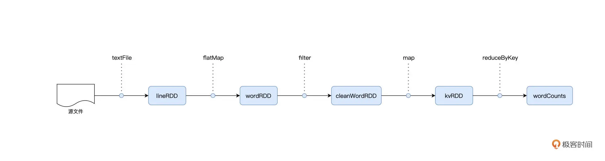 

4. **compute**:转换函数, 例如 word count 中的flatMap，filter，map等。

**RDD 算子分类**

1. **Transformations 类算子**: 使用 Transformations 类算子，定义并描述数据形态的转换过程。flatMap，filter，map，reduceByKey，sortByKey等。基于不同数据形态之间的转换，Spark会构建计算流图 DAG。
2. **Actions 类算子**: 调用 Actions 类算子，将计算结果收集起来、或是物化到磁盘。 take。Spark 通过 Actions 类算子，以回溯的方式去触发执行这个计算流图。

换句话说，开发者调用的各类 Transformations 算子，并不立即执行计算，当且仅当开发者调用 Actions 算子时，之前调用的转换算子才会付诸执行。这就是“延迟计算” Lazy Evaluation。
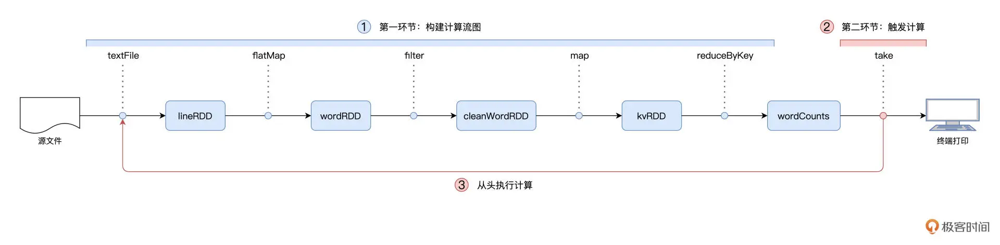

**算子总结分类**

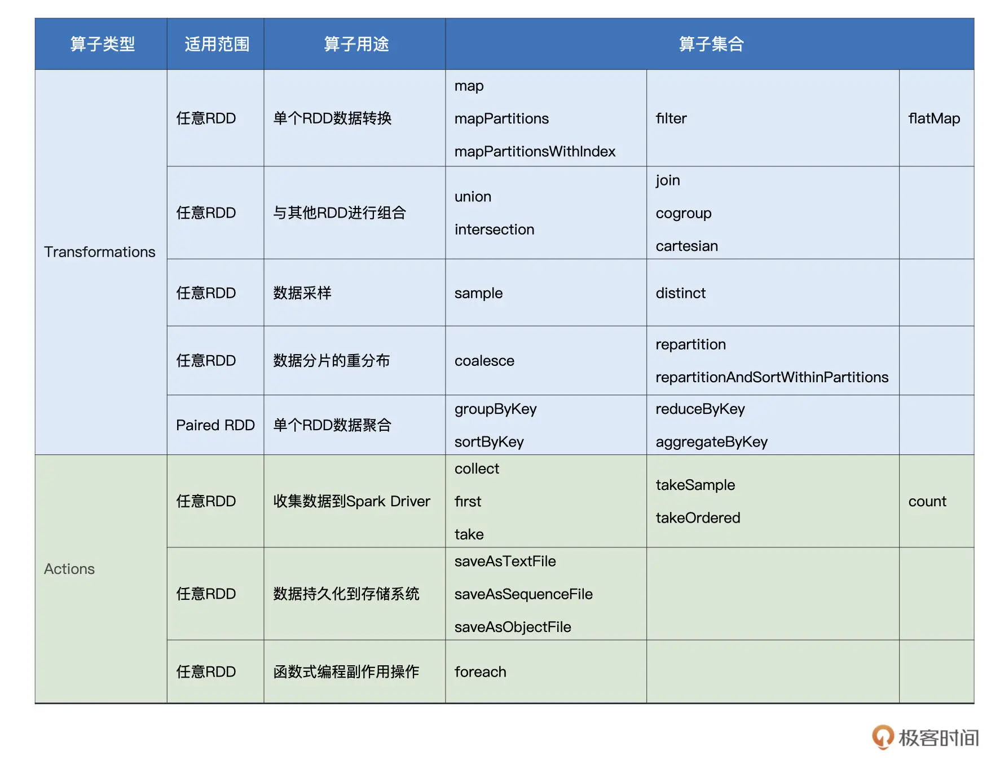

### 创建RDD

在 Spark 中，创建 RDD 的典型方式有两种：

1. 通过 SparkContext.parallelize 在内部数据之上创建 RDD。

```
import org.apache.spark.rdd.RDD
val words: Array[String] = Array("Spark", "is", "cool")
val rdd: RDD[String] = spark.sparkContext.parallelize(words)
```

2. 通过 SparkContext.textFile 等 API 从外部数据创建 RDD。
```
import org.apache.spark.rdd.RDD
val rootPath: String = FilePath
val file: String = s"${rootPath}/wikiOfSpark.txt"
// 读取文件内容
val lineRDD: RDD[String] = spark.sparkContext.textFile(file)
```

### RDD 内的数据转换: map、mapPartitions、flatMap、filter、mapPartitionsWithIndex

**map**

给定映射函数 f，map(f) 以元素为粒度对 RDD 做数据转换。其中 f 可以是带有明确签名的带名函数，也可以是匿名函数，它的形参类型必须与 RDD 的元素类型保持一致，而输出类型则任由开发者自行决定。
word count 代码中
```
   val kvRDD: RDD[(String, Int)] = cleanWordRDD.map(word => (word, 1))
```

**mapPartitions** 以数据分区为粒度的数据转换

mapPartitions，以数据分区为粒度，使用映射函数 f 对 RDD 进行数据转换
```
   val kvRDD: RDD[(String, Int)] = cleanWordRDD.mapPartitions( partition => {
     # 注意！这里是以数据分区为粒度，获取MD5对象实例

     val md5 = MessageDigest.getInstance("MD5")

     val newPartition = partition.map( word => {
     # 在处理每一条数据记录的时候，可以复用同一个Partition内的MD5对象
       (md5.digest(word.getBytes()).mkString,1)
     })
     newPartition
   })
```
我们把实例化 MD5 对象的语句挪到了 map 算子之外。如此一来，以数据分区为单位，实例化对象的操作只需要执行一次，而同一个数据分区中所有的数据记录，都可以共享该 MD5 对象，从而完成单词到哈希值的转换。
对于数据记录来说，凡是可以共享的操作，都可以用 mapPartitions 算子进行优化。

**flatMap** 从元素到集合、再从集合到元素

扁平化处理，去维度。 
```
   val wordRDD: RDD[String] = lineRDD.flatMap(line => line.split(" "))
```
flatMap的匿名函数 是 line => line.split(" ") , 返回的是数组，但是flatMap 可以扁平化处理，最终返回的类型还是 RDD[String]。

**filter** 过滤RDD
filter 算子需要借助一个判定函数 f，才能实现对 RDD 的过滤转换。
```
   val cleanWordRDD: RDD[String] = wordRDD.filter(word => !word.equals(""))
```
判定函数，它指的是类型为（RDD 元素类型） => （Boolean）的函数. 判定函数 f 的形参类型，必须与 RDD 的元素类型保持一致，而 f 的返回结果，只能是 True 或者 False. 其作用是保留 RDD 中满足 f（也就是 f 返回 True）的数据元素.

**mapPartitionsWithIndex**


### RDD 内的数据聚合: groupByKey、reduceByKey、aggregateByKey、sortByKey

groupByKey、reduceByKey、aggregateByKey、sortByKey 他们只能作用到 Paired RDD，即元素类型为（Key，Value）键值对的 RDD。

**groupByKey** 分组收集

groupByKey 算子包含两步，即分组和收集。对于元素类型为（Key，Value）键值对的 Paired RDD，groupByKey 的功能就是对 Key 值相同的元素做分组，然后把相应的 Value 值，以集合的形式收集到一起。
RDD[(Key, Value)]转换为 => RDD[(Key, Value 集合)]
```
import org.apache.spark.rdd.RDD
...

val kvRDD: RDD[(String, int)] = cleanWordRDD.map(word => (word, 1))
// 按照单词做分组收集
val words: RDD[(String, Iterable[int])] = kvRDD.groupByKey()

```

**reduceByKey** 分组聚合 

reduceByKey会引入shuffle，而且在 map端有聚合，在reduce 端也有聚合。 map 端和reduce 端使用同一个聚合函数。
以word count 为例子，(x: Int, y: Int) => x + y 就是聚合函数

```
// 把RDD元素转换为（Key，Value）的形式
val kvRDD: RDD[(String, Int)] = cleanWordRDD.map(word => (word, 1))
 
// 按照单词做分组计数
val wordCounts: RDD[(String, Int)] = kvRDD.reduceByKey((x: Int, y: Int) => x + y)
```

**aggregateByKey** 更加灵活的聚合算子

aggregateByKey 需要的参数较多，你需要提供一个初始值，一个 Map 端聚合函数 f1，以及一个 Reduce 端聚合函数 f2。且要求严格
1. 初始值类型，必须与 f2 的结果类型保持一致。
2. f1 的形参类型，必须与 Paired RDD 的 Value 类型保持一致。
3. f2 的形参类型，必须与 f1 的结果类型保持一致。

```
val rdd: RDD[(Key类型，Value类型)] = _
rdd.aggregateByKey(初始值)(f1, f2)
```
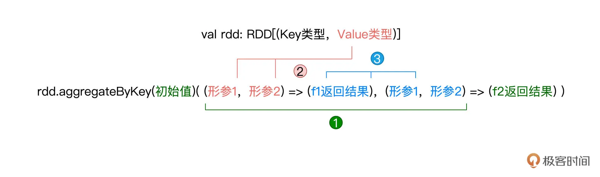

```
// 把RDD元素转换为（Key，Value）的形式
val kvRDD: RDD[(String, Int)] = cleanWordRDD.map(word => (word, 1))
 
// 显示定义Map阶段聚合函数f1
def f1(x: Int, y: Int): Int = {
return x + y
}
 
// 显示定义Reduce阶段聚合函数f2
def f2(x: Int, y: Int): Int = {
return math.max(x, y)
}
 
// 调用aggregateByKey，实现先加和、再求最大值
val wordCounts: RDD[(String, Int)] = kvRDD.aggregateByKey(0) (f1, f2)
```

**sortByKey** 排序

1. 升序排序：调用 sortByKey()、或者 sortByKey(true)；
2. 降序排序：调用 sortByKey(false)。

```
val rdd: RDD[(Key类型，Value类型)] = _
rdd.sortByKey()
```

### RDD 数据的准备、重分布与持久化

**数据准备** union、sample

1. union 用于把两个类型一致、但来源不同的 RDD 进行合并，从而构成一个统一的、更大的分布式数据集
```
// T：数据类型
val rdd1: RDD[T] = _
val rdd2: RDD[T] = _
val rdd = rdd1.union(rdd2)
// 或者rdd1 union rdd2

```

2. sample 算子用于对 RDD 做随机采样。sample 的参数比较多，分别是 withReplacement、fraction 和 seed。withReplacement 的类型是 Boolean，它的含义是“采样是否有放回”，如果这个参数的值是 true，那么采样结果中可能会包含重复的数据记录，相反，如果该值为 false。fraction 参数最好理解，它的类型是 Double，值域为 0 到 1，其含义是采样比例，也就是结果集与原数据集的尺寸比例。seed 参数是可选的，它的类型是 Long，也就是长整型，用于控制每次采样的结果是否一致
```
// 生成0到99的整型数组
val arr = (0 until 100).toArray
// 使用parallelize生成RDD
val rdd = sc.parallelize(arr)
 
// 不带seed，每次采样结果都不同
rdd.sample(false, 0.1).collect
// 结果集：Array(11, 13, 14, 39, 43, 63, 73, 78, 83, 88, 89, 90)
rdd.sample(false, 0.1).collect
// 结果集：Array(6, 9, 10, 11, 17, 36, 44, 53, 73, 74, 79, 97, 99)
 
// 带seed，每次采样结果都一样
rdd.sample(false, 0.1, 123).collect
// 结果集：Array(3, 11, 26, 59, 82, 89, 96, 99)
rdd.sample(false, 0.1, 123).collect
// 结果集：Array(3, 11, 26, 59, 82, 89, 96, 99)
 
// 有放回采样，采样结果可能包含重复值
rdd.sample(true, 0.1, 456).collect
// 结果集：Array(7, 11, 11, 23, 26, 26, 33, 41, 57, 74, 96)
rdd.sample(true, 0.1, 456).collect
// 结果集：Array(7, 11, 11, 23, 26, 26, 33, 41, 57, 74, 96)
```


**数据预处理** repartition、coalesce

并行度，它实际上就是 RDD 的数据分区数量。RDD 的 partitions 属性，记录正是 RDD 的所有数据分区。因此，RDD 的并行度与其 partitions 属性相一致。 我们可以使用 repartition 算子提升或降低 RDD 的并行度。而 coalesce 算子则只能用于降低 RDD 并行度。

1. repartition： 可以通过调用 repartition(n) 来随意调整 RDD 并行度。结合经验来说，把并行度设置为可用 CPU 的 2 到 3 倍，往往是个不错的开始。 例如，可分配给 Spark 作业的 Executors 个数为 N，每个 Executors 配置的 CPU 个数为 C，那么推荐设置的并行度坐落在 NC2 到 NC3 这个范围之间。 repartition 会引入 Shuffle。

```
// 生成0到99的整型数组
val arr = (0 until 100).toArray
// 使用parallelize生成RDD
val rdd = sc.parallelize(arr)
 
rdd.partitions.length
// 4
 
val rdd1 = rdd.repartition(2)
rdd1.partitions.length
// 2
 
val rdd2 = rdd.repartition(8)
rdd2.partitions.length
// 8
```
给定任意一条数据记录，repartition 的计算过程都是先哈希、再取模，得到的结果便是该条数据的目标分区索引。对于绝大多数的数据记录，目标分区往往坐落在另一个 Executor、甚至是另一个节点之上，因此 Shuffle 自然也就不可避免。

2. coalesce: 通过指定一个 Int 类型的形参，完成对 RDD 并行度的调整，即 coalesce (n). 只能用来降低并行度。coalesce 不会引入 Shuffle。
```
// 生成0到99的整型数组
val arr = (0 until 100).toArray
// 使用parallelize生成RDD
val rdd = sc.parallelize(arr)
 
rdd.partitions.length
// 4
 
val rdd1 = rdd.repartition(2)
rdd1.partitions.length
// 2
 
val rdd2 = rdd.coalesce(2)
rdd2.partitions.length
// 2
```
coalesce 在降低并行度的计算中，它采取的思路是把同一个 Executor 内的不同数据分区进行合并，如此一来，数据并不需要跨 Executors、跨节点进行分发，因而自然不会引入 Shuffle。


**数据收集** first、take、collect、saveAsTextFile

1. first 用于收集 RDD 数据集中的任意一条数据记录。
2. take(n: Int) 则用于收集多条记录，记录的数量由 Int 类型的参数 n 来指定。
3. collect 拿到的是全量数据，也就是把 RDD 的计算结果全量地收集到 Driver 端。 collect 算子有两处性能隐患，一个是拉取数据过程中引入的网络开销，另一个 Driver 的 OOM（内存溢出，Out of Memory）。
4. saveAsTextFile 直接调用 saveAsTextFile(path: String)。

```
import org.apache.spark.rdd.RDD
val rootPath: String = _
val file: String = s"${rootPath}/wikiOfSpark.txt"
// 读取文件内容
val lineRDD: RDD[String] = spark.sparkContext.textFile(file)
 
lineRDD.first
// res1: String = Apache Spark
 
// 以行为单位做分词
val wordRDD: RDD[String] = lineRDD.flatMap(line => line.split(" "))
val cleanWordRDD: RDD[String] = wordRDD.filter(word => !word.equals(""))
 
cleanWordRDD.take(3)
// res2: Array[String] = Array(Apache, Spark, From)
// 把RDD元素转换为（Key，Value）的形式
val kvRDD: RDD[(String, Int)] = cleanWordRDD.map(word => (word, 1))
// 按照单词做分组计数
val wordCounts: RDD[(String, Int)] = kvRDD.reduceByKey((x, y) => x + y)
 
wordCounts.collect
// res3: Array[(String, Int)] = Array((Because,1), (Open,1), (impl...
wordCounts.saveAsTextFile(targetPath)

```


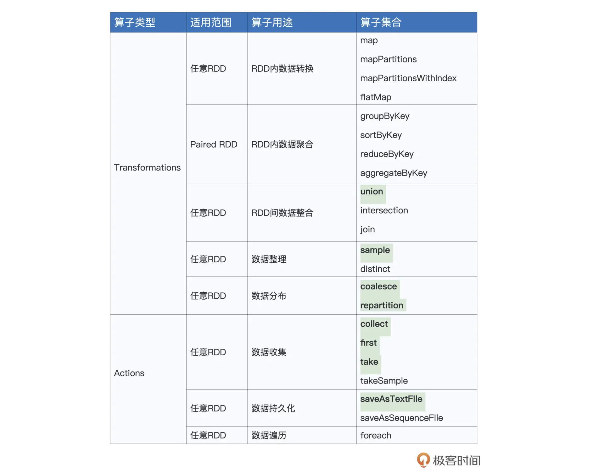


## 分布式计算

前面提到 spark 会根据RDD的数据转换构建数据流图，分布式计算则是把抽象的计算流图，转化为实实在在的分布式计算任务，然后以并行计算的方式交付执行。

在 Spark 的应用开发中，任何一个应用程序的入口，都是带有 SparkSession 的 main 函数。但有且仅有一个JVM进程运行这样的main函数，这个特殊的 JVM 进程，在 Spark 中有个专门的术语，叫作“Driver”。
Driver 最核心的作用在于，解析用户代码、构建计算流图，然后将计算流图转化为分布式任务，并把任务分发给集群中的执行进程交付运行。 而真正执行任务的进程是 Executor。 

假设现在有一个driver 和 3 个 excutors 来处理word count 程序。 过程如图：
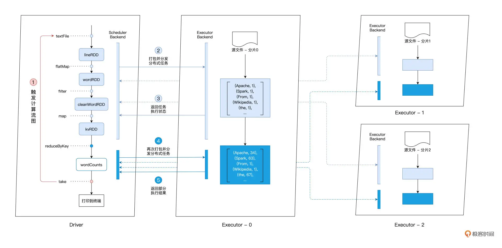

在 Spark 的 Driver 进程中，有 DAGScheduler、TaskScheduler 和 SchedulerBackend 这三个对象。

**DAGScheduler** 根据用户代码构建计算流图。
**TaskScheduler** 根据计算流图拆解出分布式任务。
**SchedulerBackend** 将分布式任务分发到 Executors 中去。

从图中可以看出 在执行 reduceByKey的时候 上下个各产生了一个分布式任务，实际上，Driver 以 Shuffle 为边界创建、分发分布式任务，因为reduceByKey 会出发shfulle的操作，所以在执行 reduceByKey的时候 上下各产生了一个 分布式任务。 
对于 reduceByKey 之前的所有操作，也就是 textFile、flatMap、filter、map 等，Driver 会把它们“捏合”成一份任务，然后一次性地把这份任务打包、分发给每一个 Executors。三个 Executors 接收到任务之后，先是对任务进行解析，把任务拆解成 textFile、flatMap、filter、map 这 4 个步骤，然后分别对自己负责的数据分片进行处理。之后就需要做分组聚合、计数操作，就必须进行刚刚说的 Shuffle 操作。在不同 Executors 完成单词的数据交换之后，Driver 继续创建并分发下一个阶段的任务，也就是按照单词做分组计数。

### Spark 调度系统 和 分布式计算

想要理解分布式计算，就需要先理解spark 的调度，spark 的调度离不开上文提到的DAGScheduler、TaskScheduler 和 SchedulerBackend 也包括 Executors 中的的对象如 ExecutorBackend等。
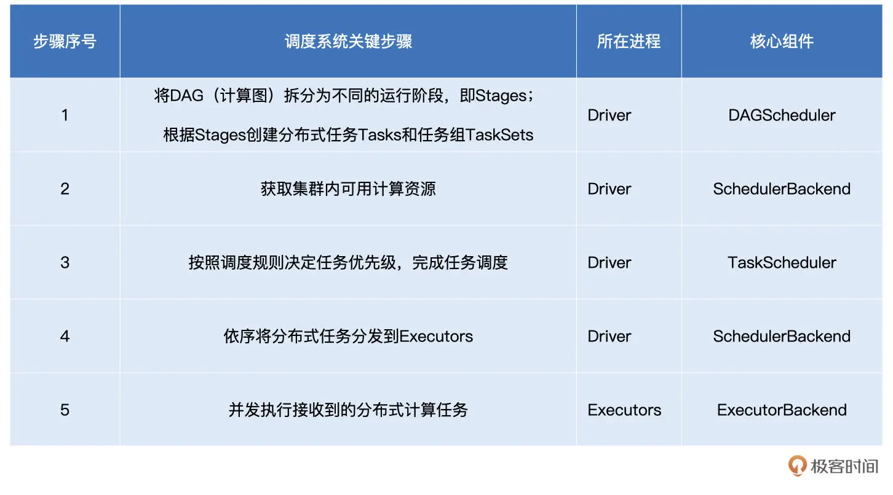

**DAGScheduler**:

DAGScheduler把DAG 拆分为执行阶段 Stages，同时还要负责把 Stages 转化为任务集合 TaskSets。
前面提到后 lazy Evaluation，只有在遇到Action 算子的时候才会回溯执行。
所以 DAGScheduler是以 Actions 算子为起点，从后向前回溯 DAG，以 Shuffle 操作为边界去划分 Stages。以 Shuffle 为边界，从后向前以递归的方式，把逻辑上的计算图 DAG，转化成一个又一个 Stages。

下图是以word count为例，介绍DAGscheduler的原理。
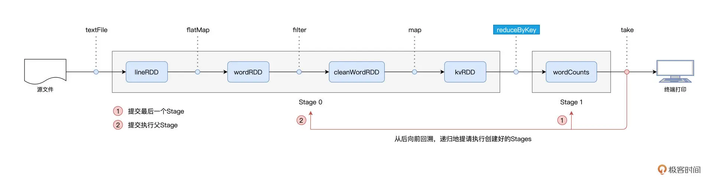

图中，spark 以take 算子为起点，依次把 DAG 中的 RDD 划入到第一个 Stage，直到遇到 reduceByKey 算子。由于 reduceByKey 算子会引入 Shuffle，因此第一个 Stage 创建完毕，且只包含 wordCounts 这一个 RDD。接下来，Spark 继续向前回溯，由于未曾碰到会引入 Shuffle 的算子，因此它把“沿途”所有的 RDD 都划入了第二个 Stage。 在stages 创建完毕，Spark从后向前，以递归的方式，依次提请执行所有的 Stages。DAGScheduler 最先提请执行的是 Stage1。在提交的时候，DAGScheduler 发现 Stage1 依赖的父 Stage，也就是 Stage0，还没有执行过，那么这个时候它会把 Stage1 的提交动作压栈，转而去提请执行 Stage0。当 Stage0 执行完毕的时候，DAGScheduler 通过出栈的动作，再次提请执行 Stage 1。

前文提到，DAGScheduler 同时还要负责把Stages 转化成任务集合 TaskSets。DAGScheduler 根据 Stage 内 RDD 的 partitions 属性创建分布式任务集合 TaskSet。TaskSet 包含一个又一个分布式任务 Task，RDD 有多少数据分区，TaskSet 就包含多少个 Task。换句话说，Task 与 RDD 的分区，是一一对应的。

DAGScheduler 的主要职责总结：
1. 根据用户代码构建 DAG。
2. 以 Shuffle 为边界切割 Stages。
3. 基于 Stages 创建 TaskSets，并将 TaskSets 提交给 TaskScheduler 请求调度。

**SchedulerBackend**

在分布式计算组件的图片中可以看到 SchedulerBackend 有两个作用，一是获取集群内可用资源，二是依次将分布式任务分发到Executors。 

SchedulerBackend 用一个叫做 ExecutorDataMap 的数据结构，来记录每一个计算节点中 Executors 的资源状态。如下图
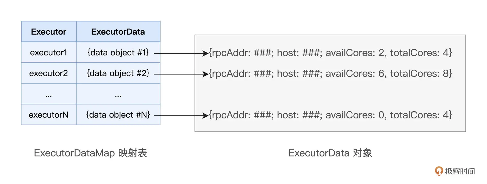

ExecutorDataMap 是一种 HashMap，它的 Key 是标记 Executor 的字符串，Value 是一种叫做 ExecutorData 的数据结构。ExecutorData 用于封装 Executor 的资源状态，如 RPC 地址、主机地址、可用 CPU 核数和满配 CPU 核数等等，它相当于是对 Executor 做的“资源画像”。SchedulerBackend 对内可以维护 Executor 的“资源画像”；对外 WorkerOffer 为粒度提供计算资源。其中，WorkerOffer 封装了 Executor ID、主机地址和 CPU 核数，它用来表示一份可用于调度任务的空闲资源。
SchedulerBackend 是如何知道哪些Executor有空闲资源的呢？实际上 SchedulerBackend 与集群内所有 Executors 中的 ExecutorBackend 保持周期性通信，双方通过 LaunchedExecutor、RemoveExecutor、StatusUpdate 等消息来互通有无、变更可用计算资源。

**TaskScheduler**

DAGScheduler 生成任务，SchedulerBackend 管理Executors资源，TaskScheduler 怎负责把任务调度到有合适资源的Executors上。 

TaskScheduler 是依据什么规则来挑选 Tasks 的呢？
对于给定的 WorkerOffer，TaskScheduler 是按照任务的本地倾向性，来遴选出 TaskSet 中适合调度的 Tasks。
前面提到 Task 与 RDD 的 partitions 是一一对应的，在创建 Task 的过程中，DAGScheduler 会根据数据分区的物理地址，来为 Task 设置 locs 属性。因此TaskScheduler可以尽可能的把task分配到数据分区所在的计算节点，甚至Executor上。 Spark 调度系统的核心思想，是“数据不动、代码动”。基于此产生了很多调度倾向性规则，如下图。

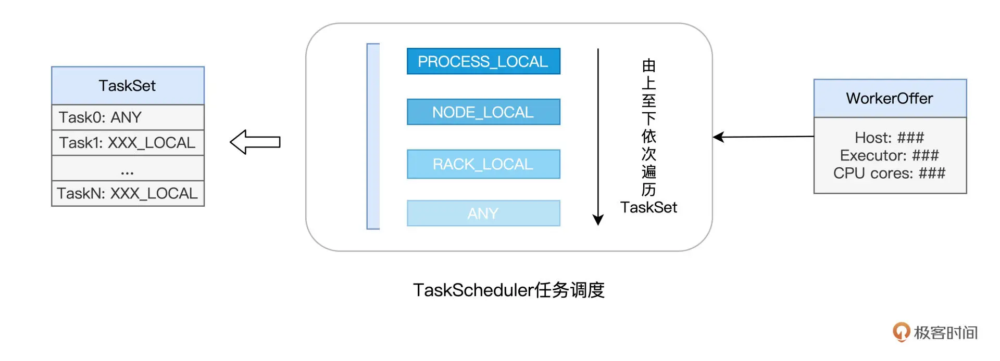

PROCESS_LOCAL：它要求对应的数据分区在某个进程（Executor）中存有副本。
NODE_LOCAL：它要求对应的数据分区在某个node中存有副本。
RACK_LOCAL：它仅要求相应的数据分区存在于同一机架即可。
ANY：对于分发的目的地没有倾向性，被调度到哪里都可以。

**ExecutorBackend**

Executors 线程池中有多个 CPU 线程，每个线程负责处理一个 Task。每当 Task 处理完毕，这些线程便会通过 ExecutorBackend，向 Driver 端的 SchedulerBackend 发送 StatusUpdate 事件，告知 Task 执行状态。接下来，TaskScheduler 与 SchedulerBackend 通过接力的方式，最终把状态汇报给 DAGScheduler。
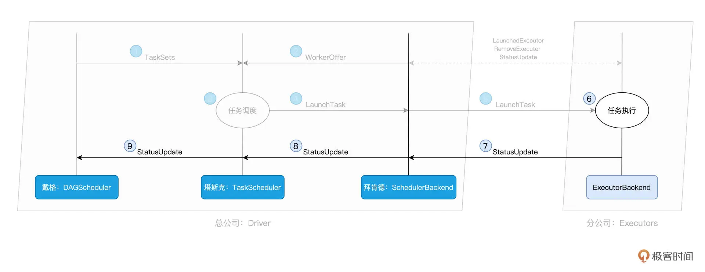

## shuffle
上文提到 DAGScheduler 以 Shuffle 为边界，把计算图 DAG 切割为多个执行阶段 Stages。而Shuffle 的计算几乎需要消耗所有类型的硬件资源，比如 CPU、内存、磁盘与网络。在绝大多数的 Spark 作业中，Shuffle 往往是作业执行性能的瓶颈。

Shuffle 的本意是扑克的“洗牌”，在分布式计算场景中，它被引申为集群范围内跨节点、跨进程的数据分发。
Shuffle 会导致分布式数据集在集群内的分发，因而引入大量的磁盘 I/O 与网络 I/O，所以说Shuffle 往往是作业执行性能的瓶颈。

在 word count 的例子中，在聚合计算的时候，会引入shuffle。 对于单词 spark而言，它可能分散在不同的Executors中，shuffle的作用就是把所有的单词spark 全部拉取到一个Executors中，进而完成聚合计算。


如图，以 Shuffle 为边界，reduceByKey 的计算被切割为两个执行阶段。Shuffle 之前的 Stage 是 Map 阶段， Shuffle 之后的 Stage 是 Reduce 阶段。
在 Map 阶段，每个 Executors 先把自己负责的数据分区做初步聚合（又叫 Map 端聚合、局部聚合）；在 Shuffle 环节，不同的单词被分发到不同节点的 Executors 中；最后的 Reduce 阶段，Executors 以单词为 Key 做第二次聚合（又叫全局聚合），从而完成统计计数的任务。

**shuffle 的中间文件**

map阶段是通过shuffle来和reduce阶段进行数据交换的，通过生产与消费 Shuffle 中间文件的方式，来完成集群范围内的数据交换。
在 Map 执行阶段，每个 Task 都会生成包含 data 文件与 index 文件的 Shuffle 中间文件。Shuffle 文件的生成，是以 Map Task 为粒度的，Map 阶段有多少个 Map Task，就会生成多少份 Shuffle 中间文件。index 文件标记了 data 文件中的哪些记录，应该由下游 Reduce 阶段中的哪些 Task 消费。 index 文件，是用来标记目标分区所属数据记录的起始索引。

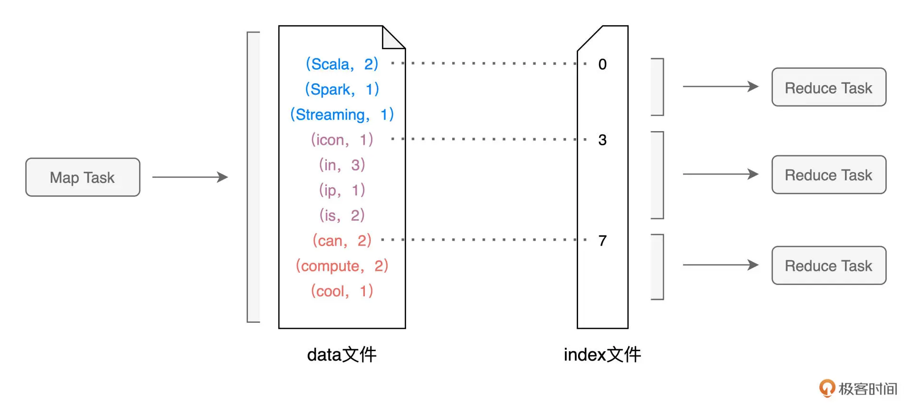

在 Spark 中，Shuffle 环节实际的数据交换规则要比这复杂得多。数据交换规则又叫分区规则，因为它定义了分布式数据集在 Reduce 阶段如何划分数据分区。假设 Reduce 阶段有 N 个 Task，这 N 个 Task 对应着 N 个数据分区，那么在 Map 阶段，每条记录应该分发到哪个 Reduce Task，是由下面的公式来决定的。
```
P = Hash(Record Key) % N
```
**Shuffle 中间文件的生成过程，分为如下几个步骤** shuffle write

1. 对于数据分区中的数据记录，逐一计算其目标分区，然后填充内存数据结构；
2. 当数据结构填满后，如果分区中还有未处理的数据记录，就对结构中的数据记录按（目标分区 ID，Key）排序，将所有数据溢出到临时文件，同时清空数据结构；
3. 重复前 2 个步骤，直到分区中所有的数据记录都被处理为止；
4. 对所有临时文件和内存数据结构中剩余的数据记录做归并排序，生成数据文件和索引文件。

**shuffle read**

对于每一个 Map Task 生成的中间文件，其中的目标分区数量是由 Reduce 阶段的任务数量（又叫并行度）决定的。

## spark 内存

我们经常听到spark是内存计算，这是它的优势。那么spark 的内存是如何划分的呢？

### Spark 内存区域划分

对于任意一个 Executor 来说，Spark 会把内存分为 4 个区域，分别是 Reserved Memory、User Memory、Execution Memory 和 Storage Memory。
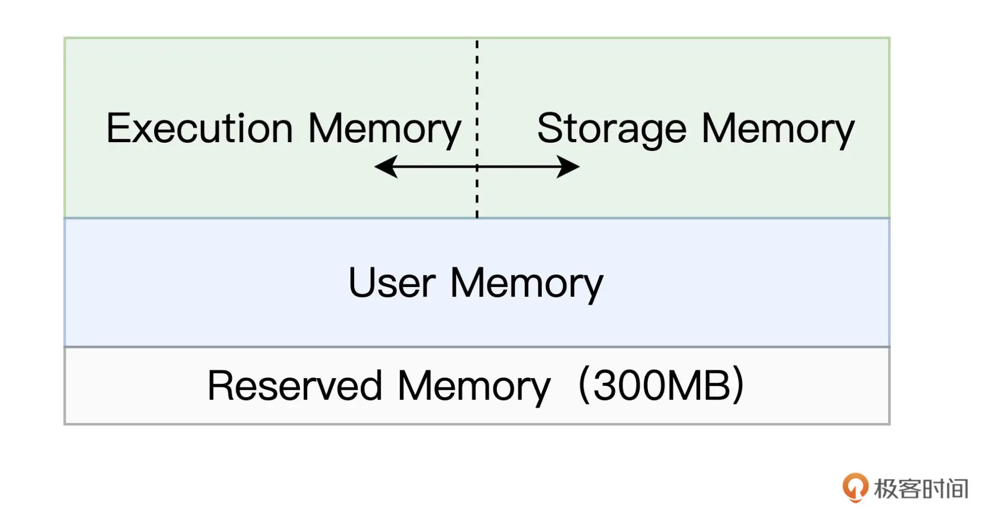

**Reserved Memory** 固定为 300MB，不受开发者控制，它是 Spark 预留的、用来存储各种 Spark 内部对象的内存区域；
**User Memory** 用于存储开发者自定义的数据结构，例如 RDD 算子中引用的数组、列表、映射等等。
**Execution Memory** 用来执行分布式任务。分布式任务的计算，主要包括数据的转换、过滤、映射、排序、聚合、归并等环节，而这些计算环节的内存消耗，统统来自于 Execution Memory。
**Storage Memory** 用于缓存分布式数据集，比如 RDD Cache、广播变量等等

其中 Execution Memory 和 Storage Memory 之间的抢占式的。抢占规则如下：
1. 如果对方的内存空间有空闲，双方可以互相抢占；
2. 对于 Storage Memory 抢占的 Execution Memory 部分，当分布式任务有计算需要时，Storage Memory 必须立即归还抢占的内存，涉及的缓存数据要么落盘、要么清除；
3. 对于 Execution Memory 抢占的 Storage Memory 部分，即便 Storage Memory 有收回内存的需要，也必须要等到分布式任务执行完毕才能释放。

另外我们也可以通过一些参数来配置spark内存。

**spark.executor.memory**: 是绝对值，它指定了 Executor 进程的 JVM Heap 总大小
**spark.memory.fraction**: 是比例值，用于标记 Spark 处理分布式数据集的内存总大小，这部分内存包括 Execution Memory 和 Storage Memory 两部分。
**spark.memory.storageFraction**: 是比例值，用来进一步区分 Execution Memory 和 Storage Memory 的初始大小。

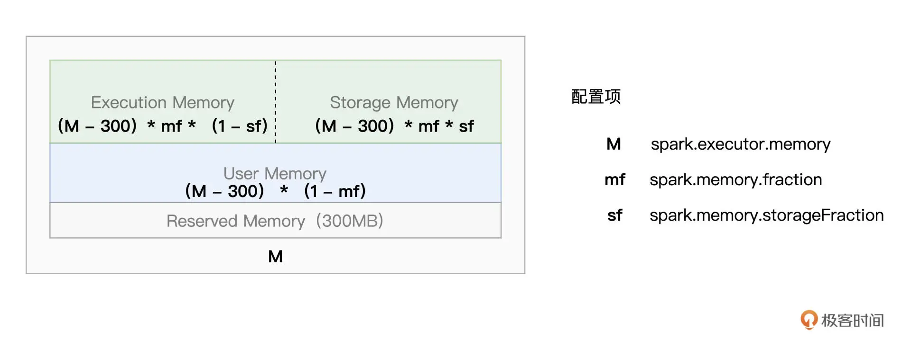

### RDD cache
在word count的代码中有很多RDD，但是我们不可能对每一个RDD 都做cache 操作，但是当同一个 RDD 被引用多次时，就可以考虑对其进行 Cache，从而提升作业的执行效率。
在之前的word count的代码中添加写入文件的操作，来演示如何使用RDD cache。
```
val wordCounts: RDD[(String, Int)] = kvRDD.reduceByKey((x, y) => x + y)

wordCounts.cache # 使用cache算子告知Spark对wordCounts加缓存
wordCounts.count # 触发wordCounts的计算，并将wordCounts缓存到内存

wordCounts.map{case (k, v) => (v, k)}.sortByKey(false).take(5) 
# 将分组计数结果落盘到文件val 
targetPath: String = TargetOPath
wordCounts.saveAsTextFile(targetPath)

```
如上述code 所示，只需要调用RDD的cache，和count 就可以实现对多次使用的RDD创建cache。我们前面提到过LazyEvaluation，所以只有在执行到count的时候，才会在内存创建RDD cache。

在深层次看一看RDDcache。 cache 函数实际上会进一步调用 persist（MEMORY_ONLY）来完成计算。当我们在调用 wordCounts.cache时，实际上执行的命令是 wordCounts.persist(MEMORY_ONLY)。实际上使用wordCounts.persist可以更灵活的选择cache的存储介质、存储形式以及副本数量。 下图为存储级别分类。
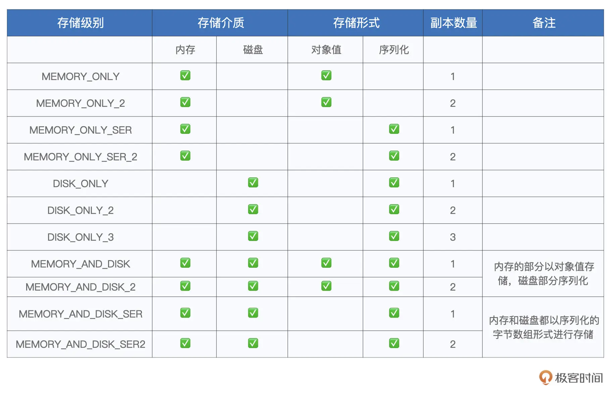

存储介质：数据缓存到内存还是磁盘，或是两者都有
存储形式：数据内容是对象值还是字节数组，带 SER 字样的表示以序列化方式存储，不带 SER 则表示采用对象值
副本数量：存储级别名字最后的数字代表拷贝数量，没有数字默认为 1 份副本。

## 广播变量和累加器。
不想整理，没意思。


## 宽窄依赖

在 Apache Spark 中，RDD（弹性分布式数据集）之间的依赖关系分为两种主要类型：窄依赖（Narrow Dependency）和宽依赖（Wide Dependency）。

窄依赖（Narrow Dependency）：
定义：父 RDD 的每个分区最多被子 RDD 的一个分区所依赖。
特点：
  - 一对一依赖：如 map、filter 等操作
  - 多对一依赖：如 coalesce 操作（分区合并）
  - 没有数据在不同节点间的移动（shuffle）
  - 执行效率高，可以在单个节点上完成计算

宽依赖（Wide Dependency）
定义：父 RDD 的每个分区可能被子 RDD 的多个分区所依赖。
特点：
  - 也称为 shuffle 依赖
  - 父 RDD 的一个分区数据可能被分发到子 RDD 的多个分区
  - 需要跨节点数据传输（shuffle）
  - 执行代价较高，可能涉及磁盘 I/O、网络传输等
  - 是划分 stage 的边界
