本文还是以一个例子来带大家了解 spark sql。数据是./exampledata/2011-2019小汽车摇号数据。 在这个目录下有 apply 和 lucky 两个子目录，apply 目录的内容是 2011-2019 年各个批次参与摇号的申请号码，而 lucky 目录包含的是各个批次中签的申请号码。 我们需要计算中签概率会不会随着倍率的增加而线性增长。 这里的倍率是申请次数。

```
import org.apache.spark.sql.DataFrame
 
val rootPath: String = ./exampledata/'2011-2019小汽车摇号数据'
# 申请者数据
val hdfs_path_apply: String = s"${rootPath}/apply"
# spark是spark-shell中默认的SparkSession实例
# 通过read API读取源文件
val applyNumbersDF: DataFrame = spark.read.parquet(hdfs_path_apply)
 
# 中签者数据
val hdfs_path_lucky: String = s"${rootPath}/lucky"
# 通过read API读取源文件
val luckyDogsDF: DataFrame = spark.read.parquet(hdfs_path_lucky)
 
# 过滤2016年以后的中签数据，且仅抽取中签号码carNum字段
val filteredLuckyDogs: DataFrame = luckyDogsDF.filter(col("batchNum") >= "201601").select("carNum")
 
# 摇号数据与中签数据做内关联，Join Key为中签号码carNum
val jointDF: DataFrame = applyNumbersDF.join(filteredLuckyDogs, Seq("carNum"), "inner")
 
# 以batchNum、carNum做分组，统计倍率系数
val multipliers: DataFrame = jointDF.groupBy(col("batchNum"),col("carNum"))
.agg(count(lit(1)).alias("multiplier"))
 
# 以carNum做分组，保留最大的倍率系数
val uniqueMultipliers: DataFrame = multipliers.groupBy("carNum")
.agg(max("multiplier").alias("multiplier"))
 
# 以multiplier倍率做分组，统计人数
val result: DataFrame = uniqueMultipliers.groupBy("multiplier")
.agg(count(lit(1)).alias("cnt"))
.orderBy("multiplier")
 
result.collect

```

## DaraFrame
SparkContext 通过 textFile API 把源数据转换为 RDD，而SparkSession通过read API把原数据转换成 DataFrame。DataFrame 和 RDD 有什么区别？
1. 与 RDD 一样，DataFrame 也用来封装分布式数据集，它也有数据分区的概念，也是通过算子来实现不同 DataFrame 之间的转换，只不过 DataFrame 采用了一套与 RDD 算子不同的独立算子集。
2. 在数据内容方面，与 RDD 不同，DataFrame 是一种带 Schema 的分布式数据集，因此，你可以简单地把 DataFrame 看作是数据库中的一张二维表。
3. DataFrame 背后的计算引擎是 Spark SQL，而 RDD 的计算引擎是 Spark Core。

### 创建DataFrame
创建 DataFrame 的方法有很多，Spark 支持多种数据源，按照数据来源进行划分，这些数据源可以分为如下几个大类：Driver 端自定义的数据结构、（分布式）文件系统、关系型数据库 RDBMS、关系型数据仓库、NoSQL 数据库，以及其他的计算引擎。
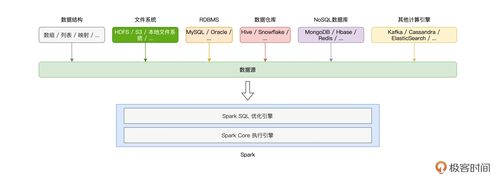

**从 Driver 创建 DataFrame**
前文提到 DataFrame相当于带有schema的RDD。所以 创建 DataFrame 的第一种方法，就是先创建 RDD，然后再给它加上Schema。这种方法比较的复杂，有如下四个步骤。
1. 使用spark context 创建 RDD
2. 创建schema
3. 把rdd转化成rdd[ROW]
4. 使用spark.createDataFrame(rowRDD,schema) 创建DataFrame 

```
import org.apache.spark.rdd.RDD
import org.apache.spark.sql.types.{StringType, IntegerType, StructField, StructType}
import org.apache.spark.sql.Row
import org.apache.spark.sql.DataFrame

# 创建RDD
val seq: Seq[(String, Int)] = Seq(("Bob", 14), ("Alice", 18))
val rdd: RDD[(String, Int)] = sc.parallelize(seq)
## 创建schema
val schema:StructType = StructType( Array(
StructField("name", StringType),
StructField("age", IntegerType)
))
# createDataFrame 要求 RDD 的类型必须是 RDD[Row]。
val rowRDD: RDD[Row] = rdd.map(fileds => Row(fileds._1, fileds._2))

# 创建DataFrame
val dataFrame: DataFrame = spark.createDataFrame(rowRDD,schema)

```

**toDF 方法**
我们可以引入 spark.implicits 轻松实现RDD 到DataFrame 的转换，甚至是从seq 到DataFrame的转换。

```

import spark.implicits._

# 创建RDD
val seq: Seq[(String, Int)] = Seq(("Bob", 14), ("Alice", 18))
val rdd: RDD[(String, Int)] = sc.parallelize(seq)

val dataFrame: DataFrame = rdd.toDF
dataFrame.show

val dataFrame1: DataFrame = seq.toDF
dataFrame1.show

val dataFrame2: DataFrame = rdd.toDF("Name","Age")
dataFrame2.show

```

**从文件系统创建 DataFrame**
这是一种更为常用的方法，spark支持的文件系统非常多，无论是哪一种文件系统，spark 都要通过SparkSession 的 read API 来读取数据并创建 DataFrame。如下图所示：

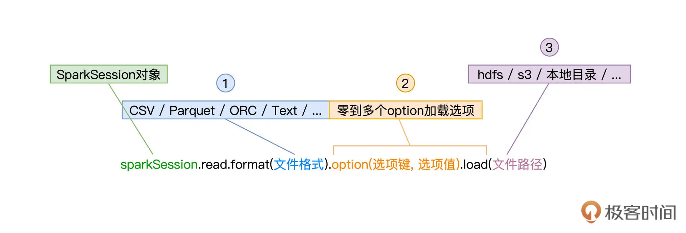

1. 第 1 类参数文件格式。如 CSV、Text、Parquet、ORC、JSON等。
2. 第 2 类参数加载选项的可选集合。如CSV 文件格式可以通过 option(“header”, true)，来表明 CSV 文件的首行为 Data Schema。当需要指定多个选项时，我们可以用“option(选项 1, 值 1).option(选项 2, 值 2)”的方式来实现。
3. 第 3 类参数是文件路径。 

**从 CSV 创建 DataFrame**
从 CSV 文件成功地创建 DataFrame，关键在于了解并熟悉与之有关的option选项。
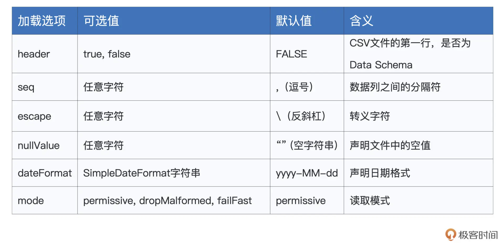

1. header: boolen 类型，默认为false。如果是false的话，DataFrame的数据列名是 _c0,_c1... 这种情况下如果想指定列名，可以定义schema，并调用schema方法，后面code中有演示。
2. seq: 它是用于分隔列数据的分隔符，可以是任意字符串，默认值是逗号。 常见的分隔符还有 Tab、“|”。
3. “escape”和“nullValue”分别用于指定文件中的转义字符和空值。
4. “dateFormat”则用于指定日期格式，默认值是“yyyy-MM-dd”。
5. “mode”，它用来指定文件的读取模式，更准确地说，它明确了 Spark SQL 应该如何对待 CSV 文件中的“脏数据”。mode 支持 3 个取值，分别是 permissive、dropMalformed 和 failFast。如下图所示。
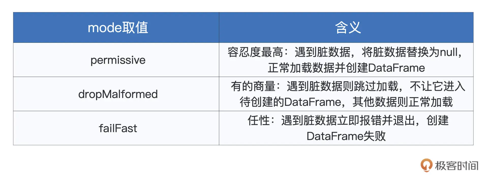

```
import org.apache.spark.sql.DataFrame
import org.apache.spark.sql.types.{StringType, IntegerType, StructField, StructType}

# 定义schema

val schema:StructType = StructType( Array(
StructField("name", StringType),
StructField("age", IntegerType)
))

val csvFilePath: String = "./exampledata/sparksessionreadcsv.csv"

val df: DataFrame = spark.read.format("csv").schema(schema).option("header", false).load(csvFilePath)

df.show


val csvFilePath: String = _
val df: DataFrame = spark.read.format("csv")
.schema(schema)
.option("header", true)
.option("mode", "dropMalformed")
.load(csvFilePath)
// df: org.apache.spark.sql.DataFrame = [name: string, age: int]
df.show


```

**从 Parquet / ORC 创建 DataFrame**

读取这两种文件比较简单，因为parquet / ORC 都是列存储文件，文件里面便存有schema的信息。因此直接读取就行。

```
val parquetFilePath: String = _
val df: DataFrame = spark.read.format("parquet").load(parquetFilePath)

val orcFilePath: String = _
val df: DataFrame = spark.read.format("orc").load(orcFilePath)
```

**从 RDBMS 创建 DataFrame**
以mysql 为例子，我们可以使用很多option 来实现从 mysql 创建 DataFrame。 在默认情况下，Spark 安装目录并没有提供与数据库连接有关的任何 Jar 包，因此，对于想要访问的数据库，不论是 MySQL、PostgreSQL，还是 Oracle、DB2，我们都需要把相关 Jar 包手工拷贝到 Spark 安装目录下的 Jars 文件夹。 
还要在 spark-shell 命令或是 spark-submit 中，通过如下两个命令行参数，来告诉 Spark 相关 Jar 包的访问地址。
–driver-class-path mysql-connector-java-version.jar
–jars mysql-connector-java-version.jar

```
spark.read.format("jdbc")
.option("driver", "com.mysql.jdbc.Driver")
.option("url", "jdbc:mysql://hostname:port/mysql")
.option("user", "用户名")
.option("password","密码")
.option("numPartitions", 20) # 控制并行度，即 DataFrame 的 Partitions 数量
.option("dbtable", "数据表名 ") # 也可以传递sql  .option("dbtable", sqlQuery)
.load()

```

## DataFrame 数据处理
DataFrame 提供了两种方法做数据处理，sql 和 DataFrame开发算子。 

### sql 语言
对于任意的 DataFrame，我们都可以使用 createTempView 或是 createGlobalTempView 在 Spark SQL 中创建临时数据表。有了临时表之后就可以使用sql语言处理数据。 

```
import org.apache.spark.sql.DataFrame
import spark.implicits._
 
val seq = Seq(("Alice", 18), ("Bob", 14))
val df = seq.toDF("name", "age")
 
df.createTempView("t1")
val query: String = "select * from t1"
// spark为SparkSession实例对象
val result: DataFrame = spark.sql(query)
 
result.show
 
```

### DataFrame 算子
DataFrame 的算子是非常多的，简单分类如下。
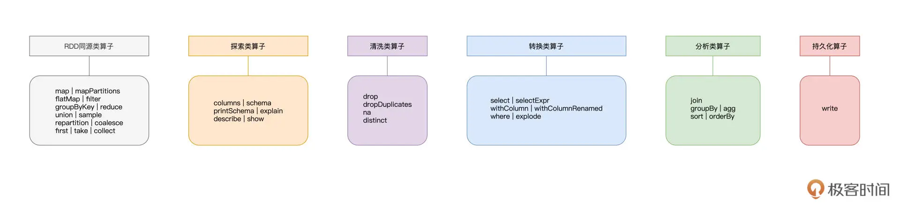

**同源类算子**
DataFrame 来自 RDD，与 RDD 具有同源性，因此 RDD 支持的大部分算子，DataFrame 都支持。
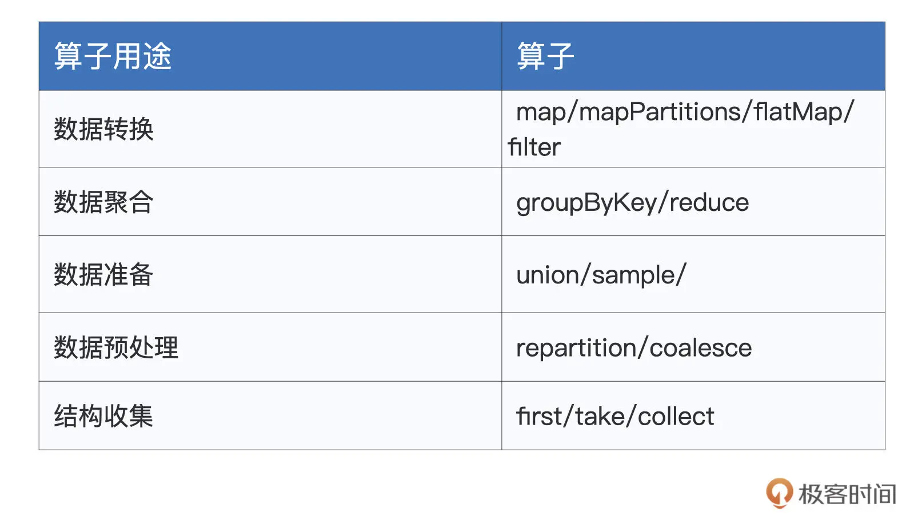

**探索类算子**
这类算子的作用，在于帮助开发者初步了解并认识数据，比如数据的模式（Schema）、数据的分布、数据的“模样”，等等。
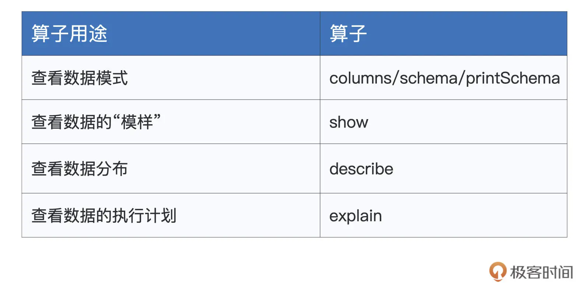

```
import org.apache.spark.sql.DataFrame
import spark.implicits._
 
val employees = Seq((1, "John", 26, "Male"), (2, "Lily", 28, "Female"), (3, "Raymond", 30, "Male"))
val employeesDF: DataFrame = employees.toDF("id", "name", "age", "gender")
 
employeesDF.printSchema
 
```

**清洗类算子**

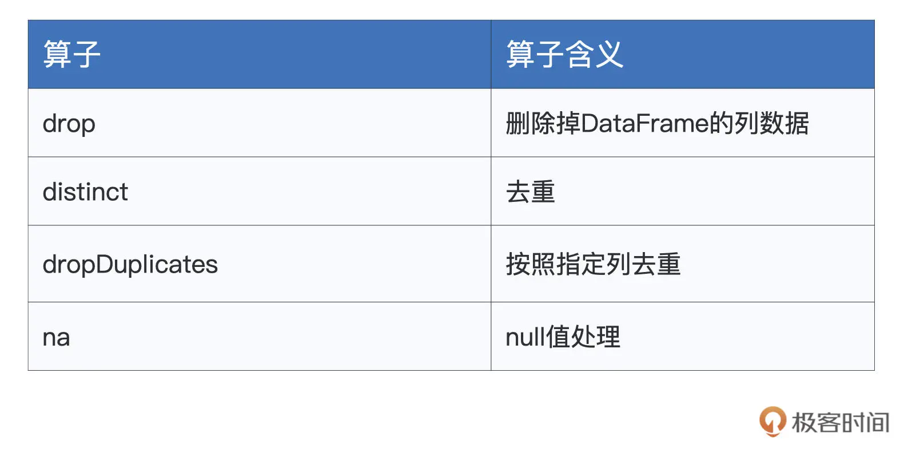

1. drop 算子允许开发者直接把指定列从 DataFrame 中予以清除。 employeesDF.drop(“gender”)
2. distinct，它用来为 DataFrame 中的数据做去重。 employeesDF.distinct
3. dropDuplicates，它的作用也是去重。不过，与 distinct 不同的是，dropDuplicates 可以指定数据列. employeesDF.dropDuplicates("gender").
4. na，它的作用是选取 DataFrame 中的 null 数据，na 往往要结合 drop 或是 fill 来使用。employeesDF.na.drop 用于删除 DataFrame 中带 null 值的数据记录。而 employeesDF.na.fill(0) 则将 DataFrame 中所有的 null 值都自动填充为整数零。

**转换类算子**
转换类算子的主要用于数据的生成、提取与转换。

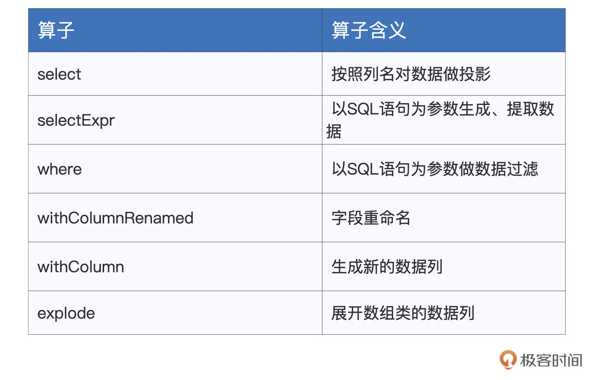

1. select 算子让我们可以按照列名对 DataFrame 做投影，比如说，如果我们只关心年龄与性别这两个字段的话，就可以使用下面的语句来实现。
```
employeesDF.select("name", "gender").show
```
2. selectExpr 相较于select 更为灵活。
```
employeesDF.selectExpr("id", "name", "concat(id, '_', name) as id_name").show
 
/** 结果打印
+---+-------+---------+
| id| name| id_name|
+---+-------+---------+
| 1| John| 1_John|
| 2| Lily| 2_Lily|
| 3|Raymond|3_Raymond|
+---+-------+---------+
*/
```
3. where 是对 DataFrame 做数据过滤。
```
employeesDF.where(“gender = ‘Male’”)
```
4. withColumnRenamed 的作用是字段重命名
```
employeesDF.withColumnRenamed(“gender”, “sex”)。
```
5. withColumn 则用于生成新的数据列.
```
employeesDF.withColumn("crypto", hash($"age")).show
 
/** 结果打印
+---+-------+---+------+-----------+
| id| name|age|gender| crypto|
+---+-------+---+------+-----------+
| 1| John| 26| Male|-1223696181|
| 2| Lily| 28|Female|-1721654386|
| 3|Raymond| 30| Male| 1796998381|
+---+-------+---+------+-----------+
*/
```
6. explode,它的作用是展开数组类型的数据列，数组当中的每一个元素，都会生成一行新的数据记录。 爆炸函数。 
```
val seq = Seq( (1, "John", 26, "Male", Seq("Sports", "News")),
(2, "Lily", 28, "Female", Seq("Shopping", "Reading")),
(3, "Raymond", 30, "Male", Seq("Sports", "Reading"))
)
 
val employeesDF: DataFrame = seq.toDF("id", "name", "age", "gender", "interests")
employeesDF.show
 
/** 结果打印
+---+-------+---+------+-------------------+
| id| name|age|gender| interests|
+---+-------+---+------+-------------------+
| 1| John| 26| Male| [Sports, News]|
| 2| Lily| 28|Female|[Shopping, Reading]|
| 3|Raymond| 30| Male| [Sports, Reading]|
+---+-------+---+------+-------------------+
*/
 
employeesDF.withColumn("interest", explode($"interests")).show
 
/** 结果打印
+---+-------+---+------+-------------------+--------+
| id| name|age|gender| interests|interest|
+---+-------+---+------+-------------------+--------+
| 1| John| 26| Male| [Sports, News]| Sports|
| 1| John| 26| Male| [Sports, News]| News|
| 2| Lily| 28|Female|[Shopping, Reading]|Shopping|
| 2| Lily| 28|Female|[Shopping, Reading]| Reading|
| 3|Raymond| 30| Male| [Sports, Reading]| Sports|
| 3|Raymond| 30| Male| [Sports, Reading]| Reading|
+---+-------+---+------+-------------------+--------+
*/
```

**分析类算子**
在大多数的数据应用中，数据分析往往是最为关键的那环，甚至是应用本身的核心目的。
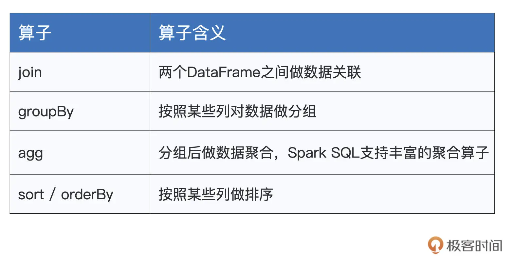

为了演示上述算子的用法，我们先来准备两张数据表：employees 和 salaries，也即员工信息表和薪水表。我们的想法是，通过对两张表做数据关联，来分析员工薪水的分布情况。

```
import spark.implicits._
import org.apache.spark.sql.DataFrame
 
// 创建员工信息表
val seq = Seq((1, "Mike", 28, "Male"), (2, "Lily", 30, "Female"), (3, "Raymond", 26, "Male"))
val employees: DataFrame = seq.toDF("id", "name", "age", "gender")
 
// 创建薪水表
val seq2 = Seq((1, 26000), (2, 30000), (4, 25000), (3, 20000))
val salaries:DataFrame = seq2.toDF("id", "salary")
 
employees.show
 
/** 结果打印
+---+-------+---+------+
| id| name|age|gender|
+---+-------+---+------+
| 1| Mike| 28| Male|
| 2| Lily| 30|Female|
| 3|Raymond| 26| Male|
+---+-------+---+------+
*/
 
salaries.show
 
/** 结果打印
+---+------+
| id|salary|
+---+------+
| 1| 26000|
| 2| 30000|
| 4| 25000|
| 3| 20000|
+---+------+
*/

val jointDF: DataFrame = salaries.join(employees, Seq("id"), "inner")
 
jointDF.show
 
/** 结果打印
+---+------+-------+---+------+
| id|salary| name|age|gender|
+---+------+-------+---+------+
| 1| 26000| Mike| 28| Male|
| 2| 30000| Lily| 30|Female|
| 3| 20000|Raymond| 26| Male|
+---+------+-------+---+------+
*/

val aggResult = fullInfo.groupBy("gender").agg(sum("salary").as("sum_salary"), avg("salary").as("avg_salary"))
 
aggResult.show
 
/** 数据打印
+------+----------+----------+
|gender|sum_salary|avg_salary|
+------+----------+----------+
|Female| 30000| 30000.0|
| Male| 46000| 23000.0|
+------+----------+----------+
*/
aggResult.sort(desc("sum_salary"), asc("gender")).show
 
/** 结果打印
+------+----------+----------+
|gender|sum_salary|avg_salary|
+------+----------+----------+
| Male| 46000| 23000.0|
|Female| 30000| 30000.0|
+------+----------+----------+
*/
 
aggResult.orderBy(desc("sum_salary"), asc("gender")).show
 
/** 结果打印
+------+----------+----------+
|gender|sum_salary|avg_salary|
+------+----------+----------+
| Male| 46000| 23000.0|
|Female| 30000| 30000.0|
+------+----------+----------+
*/

```

**持久化类算子**

与read API 类似，write API 也有 3 个关键环节，分别是同样由 format 定义的文件格式，零到多个由 option 构成的“写入选项”，以及由 save 指定的存储路径，如下图所示。
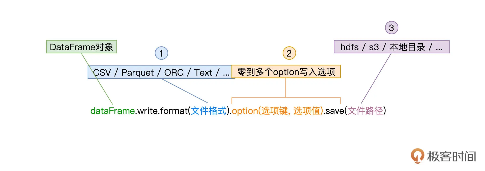

在option方法中可以指定文件写入的mode， 文件写入mode 有 Append、Overwrite、ErrorIfExists、Ignore 这 4 种模式。

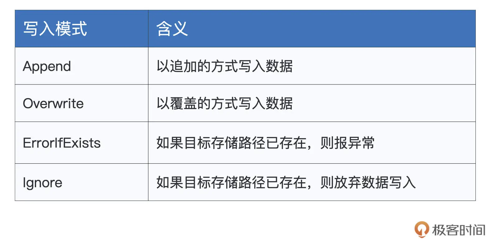